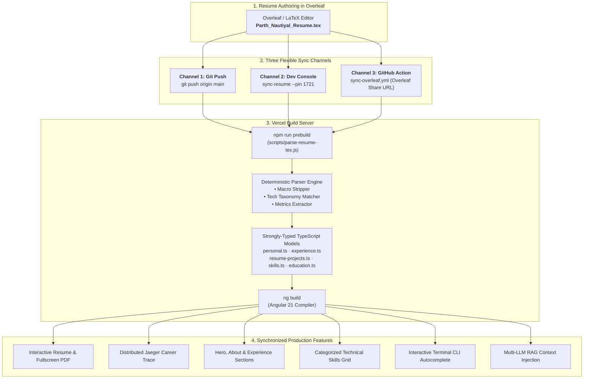

# Parth Nautiyal — Backend & Systems Engineer Portfolio

<div align="center">


<br/>

[](https://angular.io/)
[](https://spring.io/projects/spring-boot)
[](https://www.oracle.com/java/)
[](https://tailwindcss.com/)
[](https://kafka.apache.org/)
[](https://temporal.io/)
[](https://parthnautiyal.vercel.app/)

<br/>

**Live Site:** [parthnautiyal.vercel.app](https://parthnautiyal.vercel.app/) &nbsp;|&nbsp; **Portfolio Repo:** [github.com/parthnautiyal/portfolio](https://github.com/parthnautiyal/portfolio)

</div>

---

## 🏛️ Architecture Documentation

Complete architectural diagrams, design specifications, and sequence flows are documented in the [docs/architecture/](docs/architecture/README.md) directory:

| Document | Topic & Scope | Diagrams Included |
| :--- | :--- | :--- |
| 🌐 **[01. System Overview & Deployment](docs/architecture/01_SYSTEM_OVERVIEW.md)** | Global deployment topography, Vercel routing, Render Spring Boot microservice, edge reverse proxies. | System Topography, Request Routing & Proxy Flow |
| 📄 **[02. Resume Synchronization Pipeline](docs/architecture/02_RESUME_SYNC_PIPELINE.md)** | Single source of truth Overleaf pipeline, token parser engine, zero-config PIN deployment security. | End-to-End Sync Pipeline, Token Extraction Engine, PIN Security Sequence |
| 🎮 **[03. Interactive Features & State](docs/architecture/03_INTERACTIVE_FEATURES_AND_STATE.md)** | Tokenized deep-linking, Zone-safe change detection, CLI state machine, quest gamification. | Tokenization State Cycle, Terminal State Machine, Quest Gamification Flow |
| 🤖 **[04. Multi-LLM RAG & Microservices](docs/architecture/04_AI_AND_MICROSERVICES.md)** | Multi-provider AI fallback engine, context injection, Kafka event streaming, Temporal workflows. | Multi-LLM RAG Sequence, Distributed Microservices Architecture |

---

## 🌟 Highlights & Key Features

### 💻 1. Interactive Developer Console (Parth OS v2.0 Terminal)
* **Always-Collapsed Sleek Edge Tab**: Docked seamlessly to the left screen edge (`fixed left-0 z-40`) with a green prompt icon (`>_`) and live pulsing activity status indicator.
* **Vertical Drag & 1-Click Seamless Pop**: Users can drag the tab vertically along the edge to their preferred height. A single click expands the terminal window immediately without intermediate steps.
* **Anchored Coordinate Expansion**: The terminal window opens anchored directly to the vertical position (`position.y`) of the collapsed button with a physical scale/pop animation (`transform-origin: 0px [relY]px`), ensuring the window never abruptly pops to the top of the viewport disconnected from user interaction.
* **27+ Production & Easter-Egg CLI Commands**: Includes `help`, `about`, `skills`, `projects`, `exp`, `edu`, `resume`, `contact`, `whoami`, `neofetch`, `matrix` (falling green code rain), `ping`, `system`, `sync-resume --pin 1721`, `clear`, `joke`, `banner`, `history`, `sudo`, `cat`, and more.
* **Interactive Autocomplete Grid**: Visual keyboard suggestions bar with **Tab** cycling, **Enter** selection, and **Escape** dismissal.
* **macOS Terminal Window Controls**: Close, minimize, double-click titlebar to toggle fullscreen maximize, and global `Ctrl + \`` shortcut toggle.

---

### 🏆 2. Recruiter Quest Tracker & Gamification Engine
* **Always-Collapsed Right Edge Tab**: Sleek edge tab docked to the right screen edge (`fixed right-0 z-[99]`) featuring an interactive trophy badge and real-time XP pulse indicator, with vertical edge-drag repositioning.
* **1-Click Slide-Out Challenges Drawer**: 1-click slides out the Quest Tracker drawer (`translate-x-0`) with backdrop click-to-dismiss.
* **5 Recruiter Progression Levels**: Progress from *Novice Reviewer* (Lvl 1) → *Observer* (Lvl 2) → *Reliability Inspector* (Lvl 3) → *Systems Analyst* (Lvl 4) → *Lead System Evaluator* (Lvl 5) via real-time XP tracking (0–500 XP).
* **6 Interactive Exploration Achievements**:
  * `LAND_ON_PORTFOLIO` (+50 XP): Initialize terminal session and visit portfolio.
  * `VIEW_RESUME` (+75 XP): Access the interactive resume breakdown.
  * `FULLSCREEN_PDF` (+75 XP): Launch the PDF viewer in fullscreen mode.
  * `TRIGGER_CHAOS` (+100 XP): Simulate microservice failure via Chaos Monkey.
  * `CHAT_QUERY` (+100 XP): Query the multi-LLM career assistant.
  * `EXPAND_PROMOTION` (+100 XP): Inspect SDE I → SDE II promotion details in career trace.
* **Toast Notification Engine**: Animated glassmorphism toast notifications with sound indicators, XP pill badges, and progress reset simulator.

---

### 🔍 3. Interactive Resume & Fullscreen PDF Viewer
* **Dynamic Search & Deep Linking**: Instant in-page keyword search with match counter and synchronized scroll-to-highlight.
* **Recruiter Role Focus Filters**: One-click toggles for *Standard*, *Backend*, *DevOps*, and *Full-Stack* engineering keywords with synchronized badge highlighting and toggle-off on second click.
* **Interactive Fullscreen Zoom Toolbar**:
  * **Zoom In (+)** & **Zoom Out (-)** with live zoom percentage display (`pdfZoom%`).
  * **Reset (100%)** button.
  * **Native PDF Viewer Fallback** (`target="_blank"`) for full native pinch, pan, search, and printing in iOS Safari and Android Chrome.
* **Vibrant Technical Skill Taxonomy**: Categorized skill cards with brand border colors and dark mode contrast matching the home page theme.

---

### 🏛️ 4. System Architecture Canvas & Observability Telemetry
* **Interactive Distributed System Canvas**: Visual topology depicting the end-to-end request lifecycle across Cloudflare CDN, Vercel Edge proxies, Spring Boot Gateway, Apache Kafka event streaming, Temporal.io workflow orchestration, PostgreSQL, Redis, Jaeger Distributed Tracing, and Prometheus/Grafana.
* **Simulated Chaos Monkey**: Real-time chaos injection button to simulate microservice and network partition failures, triggering circuit-breaker trips and self-healing state transitions.
* **Live Telemetry & Observability Logs**: Real-time trace logs with Trace IDs, span duration metrics, and status badges in a mobile-safe, overflow-contained log viewer.
* **CI/CD Pipeline Visualizer**: Interactive 4-stage pipeline (Lint, Unit Test, Docker Containerize, Edge Deploy) with expandable build logs.

---

### 📊 5. Distributed Career Trace Timeline (Jaeger View)
* Interactive distributed systems trace visualization mapping career progression at **ZopSmart** (SDE II, SDE I, and SDE Intern) as microservices trace spans.
* Real-time metrics highlighting **50% latency reduction via Kafka**, **Temporal workflow decompositions into 11+ activities**, and **9m to 4m CI/CD speedups**.
* Responsive horizontal overflow scroll wrapper with mobile touch swipe indicators to prevent timeline collision.

---

### ⚡ 6. Projects Showcase (Instant Cache + Real-Time GitHub Sync)
* **0ms Instant Cache Loading**: Initialized with bundled static project data so projects render immediately without network delay.
* **Stale-While-Revalidate GitHub Sync**: Asynchronously fetches live GitHub API metrics (stars, forks, last commit timestamps) in the background without blocking the UI.
* **Category Filters**: Filter projects by *All*, *Backend / Systems*, *AI / ML*, and *Cloud / DevOps*.
* **WCAG High-Contrast Typography**: Explicit high-contrast palette in both dark and light themes.

---

### 🤖 7. Multi-LLM RAG Chatbot & Career Assistant
* Intelligent context-injected chatbot capable of answering questions about Parth's background, system architecture decisions, and code patterns.
* **Multi-Provider Fallback Engine**: **Claude 3.5**, **Google Gemini API**, **OpenAI GPT-4o-mini**, and local offline **Ollama (Llama 3)**.
* **Recruiter Quick Prompts**: Quick prompt suggestions tailored for engineering managers and technical recruiters.

---

### 📱 8. Mobile-First Responsive Experience & 1-Tap Bottom Navigation
* **1-Tap Mobile Bottom Navigation Bar**: Fixed bottom bar on mobile (`flex md:hidden`) with frosted glass blur (`backdrop-blur-xl`) for 1-tap switching between Home, Resume, Projects, System, and Chat.
* **Bounds-Checked Viewport Meta**: Configured with `viewport-fit=cover` and bounds-checked zoom, preventing iOS Safari 0.5x scaling bugs when navigating between heavy canvas pages and the homepage.
* **Safe-Area Content Insets**: `<main>` container configured with `pb-28 md:pb-16` padding so page content is never obscured by mobile navigation bars.

---

## 📂 Repository Structure

```text
portfolio/
├── Parth_Nautiyal_Resume.tex       # Overleaf LaTeX resume (Primary Single Source of Truth)
├── Parth_Nautiyal_Resume.pdf       # Compiled PDF resume
├── scripts/
│   ├── parse-resume-tex.js         # Zero-dependency LaTeX resume parser & TS content generator
│   └── fetch-projects.js           # GitHub API sync script
├── api/                            # Vercel Serverless API endpoints
│   └── job-match.js                # AI Job match resume compatibility checker
├── portfolio-frontend/             # Angular 21 Single Page Application
│   ├── src/
│   │   ├── app/
│   │   │   ├── components/         # Reusable UI components (Navbar, Footer, DevConsole, etc.)
│   │   │   ├── content/            # Auto-generated TS content files (synced from LaTeX)
│   │   │   │   ├── personal.ts
│   │   │   │   ├── experience.ts
│   │   │   │   ├── resume-projects.ts
│   │   │   │   ├── skills.ts
│   │   │   │   └── education.ts
│   │   │   ├── pages/              # Routed pages (Home, Resume Viewer, Architecture, Chat)
│   │   │   ├── sections/           # Landing page sections (Hero, Experience, Skills, Education)
│   │   │   ├── services/           # Services (QuestService, ThemeService, ChatService)
│   │   │   └── utils/
│   │   │       └── contentLoader.ts# Centralized typed data accessor layer
│   │   └── styles.css              # Global Tailwind CSS v4 design system
│   └── package.json
└── portfolio-backend/              # Spring Boot 3.4.x Backend Microservice
    ├── src/main/java/              # REST Controllers, Mail Service, LLM integrations
    └── pom.xml
```

---

## 🛠️ Local Development Guide

### Prerequisites
1. **Node.js**: v20.x or higher
2. **JDK**: Java 21 or higher
3. **Ollama** *(Optional)*: For offline AI features

---

### 1. Running the Angular Frontend

```bash
# Navigate to the frontend directory
cd portfolio-frontend

# Install dependencies
npm install

# Run the automated LaTeX resume sync
npm run sync-resume

# Start the Angular development server
npm start
```
The frontend will launch locally at **`http://localhost:4200`**.

---

### 2. Running the Spring Boot Backend

```bash
# Navigate to the backend directory
cd portfolio-backend

# Configure environment variables (or create .env)
export GEMINI_API_KEY="your_api_key"
export SPRING_MAIL_USERNAME="your_email@gmail.com"
export SPRING_MAIL_PASSWORD="your_app_password"

# Launch Spring Boot server
./mvnw spring-boot:run
```
The backend server will start on **`http://localhost:8080`**.

---

### 3. Local Offline AI with Ollama (Optional)

To run the chatbot fully offline without API keys:
```bash
# Pull Llama 3 model
ollama pull llama3

# Start Ollama with CORS enabled
OLLAMA_ORIGINS="*" ollama serve
```

---

## 🔄 Automated Resume Synchronization Pipeline (How It Works)

### 💡 Architectural Philosophy: Single Source of Truth
Developer portfolios and resumes frequently diverge, requiring tedious manual updates across HTML, markdown, and JSON files every time a new role, metric, or project changes. This portfolio solves that problem completely by establishing **`Parth_Nautiyal_Resume.tex`** (authored and maintained directly in Overleaf) as the **single source of truth** across the entire application.



---

### ⚙️ Deterministic Parser Engine (`scripts/parse-resume-tex.js`)
The parser is a lightweight, zero-dependency Node.js script designed for deterministic compilation:
1. **Macro Stripper**: Automatically strips LaTeX formatting macros (`\textbf{...}`, `\textit{...}`, `\href{url}{text}`, `\item`, `\hfill`, `\begin{itemize}`, etc.) while preserving clean plaintext content and external hyperlinked URLs.
2. **Taxonomy & Brand Palette Mapping**: Scans raw skill keywords and maps them to an extensible tech taxonomy with brand hex colors and SVG icons (e.g., Spring Boot, Kafka, Temporal, Angular, AWS, Docker, Kubernetes).
3. **Structured Model Generator**: Compiles extracted data into strongly-typed TypeScript models under `src/app/content/`:
   * `personal.ts`: Full name, contact details, headline summary, LinkedIn, GitHub, and email.
   * `experience.ts`: Company names, titles, date spans, location, and quantified bullet points (e.g., 50% latency reduction, 11+ activities).
   * `resume-projects.ts`: Project titles, live demo URLs, GitHub repo links, descriptions, and tech stacks.
   * `skills.ts`: Categorized taxonomy (*Languages*, *Frameworks*, *Distributed Systems*, *Databases*, *DevOps/Cloud*).
   * `education.ts`: University name, degree, graduation year, coursework, and GPA.

---

### 🚀 The 3 Synchronization Channels

#### 🌐 Channel 1: Automated Git Push / Vercel Build Webhook
* **How it works**: Whenever you push changes to `Parth_Nautiyal_Resume.tex` on GitHub (`git push origin main`), Vercel triggers a production deployment.
* **Prebuild Hook**: `package.json` defines `"prebuild": "node ../scripts/parse-resume-tex.js"`.
* **Result**: The Angular build compiler consumes the newly generated TypeScript models, updating all pages and sections in ~60 seconds.

#### 🔐 Channel 2: In-Browser Dev Console (Zero-Config PIN Gatekeeper)
You can trigger an on-the-fly rebuild of your resume from **any device in the world** (phone, tablet, work laptop) without ever having to paste or carry the long Vercel Hook URL:
1. **One-Time Cloud Setup**:
   * Add `VERCEL_DEPLOY_HOOK_URL` in your **Vercel Project Settings** (*Settings → Environment Variables*).
2. **Trigger Instant Build on ANY Device**:
   * Open the Developer Console (`Ctrl + \`` or click the left edge tab) and type:
   ```bash
   sync-resume --pin 1721
   ```
   * The backend validates your PIN and triggers the Vercel Deploy Hook server-side.
3. **Alternative Device-Local Hook Override**:
   ```bash
   sync-resume --pin 1721 --set-hook https://api.vercel.com/v1/integrations/deploy/prj_xxxx/yyyy
   ```

#### 🔄 Channel 3: Overleaf Share Link + GitHub Actions Workflow
For hands-off, cloud-to-cloud extraction without manual git commits:
1. In Overleaf, click **Share** (top right) → enable **"Anyone with this link can view"** and copy the read link (e.g. `https://www.overleaf.com/read/ggtqqhjpqgsw#c32362`).
2. Save it as a GitHub Secret named **`OVERLEAF_SHARE_URL`** in your repository settings (*Settings → Secrets and variables → Actions*).
3. The `.github/workflows/sync-overleaf.yml` workflow can run on a schedule or be triggered manually (**Actions → Sync Overleaf Resume → Run workflow**):
   * Downloads the raw `.tex` source directly from Overleaf.
   * Runs `scripts/parse-resume-tex.js` to compile TypeScript models.
   * Commits the updated files to `main` and triggers the Vercel Deploy Hook automatically.

---

## 🧪 Testing & Quality Assurance

The frontend test suite is powered by **Vitest** and the **Angular TestBed**:

```bash
# Run unit tests
cd portfolio-frontend
npm test -- --watch=false

# Run production build
npx ng build
```

* **Unit Test Suite**: 48/48 tests passing across `contentLoader.test.ts`, `analytics.test.ts`, and `app.spec.ts`.
* **Production Compilation**: 0 errors, 0 strict type violations, optimized tree-shaken chunks.

---

## 👤 Author

**Parth Nautiyal**
* **Portfolio:** [parthnautiyal.vercel.app](https://parthnautiyal.vercel.app/)
* **LinkedIn:** [linkedin.com/in/parthnautiyal](https://www.linkedin.com/in/parthnautiyal/)
* **GitHub:** [github.com/parthnautiyal](https://github.com/parthnautiyal)
* **LeetCode:** [leetcode.com/u/parth_nautiyal](https://leetcode.com/u/parth_nautiyal/)
* **Email:** [parthnautiyal2002@gmail.com](mailto:parthnautiyal2002@gmail.com)
