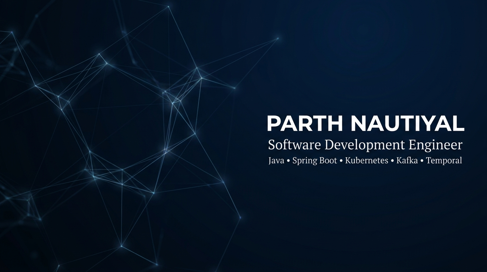
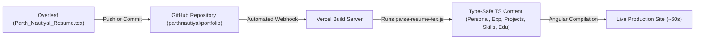

# Parth Nautiyal — Backend & Systems Engineer Portfolio

<div align="center">



<br/>

[](https://angular.io/)
[](https://spring.io/projects/spring-boot)
[](https://www.oracle.com/java/)
[](https://tailwindcss.com/)
[](https://kafka.apache.org/)
[](https://temporal.io/)
[](https://parthnautiyal.vercel.app/)

<br/>

**Live Site:** [parthnautiyal.vercel.app](https://parthnautiyal.vercel.app/) &nbsp;|&nbsp; **Portfolio Repo:** [github.com/parthnautiyal/portfolio](https://github.com/parthnautiyal/portfolio)

</div>

---

## 🏛️ Architecture Documentation

Complete architectural diagrams, design specifications, and sequence flows are documented in the [docs/architecture/](docs/architecture/README.md) directory:

| Document | Topic & Scope | Diagrams Included |
| :--- | :--- | :--- |
| 🌐 **[01. System Overview & Deployment](docs/architecture/01_SYSTEM_OVERVIEW.md)** | Global deployment topography, Vercel routing, Render Spring Boot microservice, edge reverse proxies. | System Topography, Request Routing & Proxy Flow |
| 📄 **[02. Resume Synchronization Pipeline](docs/architecture/02_RESUME_SYNC_PIPELINE.md)** | Single source of truth Overleaf pipeline, token parser engine, zero-config PIN deployment security. | End-to-End Sync Pipeline, Token Extraction Engine, PIN Security Sequence |
| 🎮 **[03. Interactive Features & State](docs/architecture/03_INTERACTIVE_FEATURES_AND_STATE.md)** | Tokenized deep-linking, Zone-safe change detection, CLI state machine, quest gamification. | Tokenization State Cycle, Terminal State Machine, Quest Gamification Flow |
| 🤖 **[04. Multi-LLM RAG & Microservices](docs/architecture/04_AI_AND_MICROSERVICES.md)** | Multi-provider AI fallback engine, context injection, Kafka event streaming, Temporal workflows. | Multi-LLM RAG Sequence, Distributed Microservices Architecture |

---

## 🌟 Highlights & Key Features

### 📄 1. Overleaf / LaTeX Single Source of Truth (`scripts/parse-resume-tex.js`)
* **Zero-Dependency LaTeX Parser**: Automatically reads `Parth_Nautiyal_Resume.tex`, strips formatting macros (`\textbf`, `\textit`, `\href`, `\item`, `\hfill`), maps skill names to brand colors/icons, and compiles strongly-typed TypeScript models:
  * `personal.ts` (Contact details, summary headline, social links)
  * `experience.ts` (Roles, metrics, Kafka/Temporal latency benchmarks)
  * `resume-projects.ts` (OutreachIQ & AI Portfolio with live/GitHub URLs)
  * `skills.ts` (Categorized technical skill taxonomy)
  * `education.ts` (Degree, GPA, coursework)
* **Automated Prebuild Sync**: Embedded into `npm run prebuild` so every build continuously reflects your latest Overleaf resume.



---

### 🔍 2. Interactive Resume & Fullscreen PDF Viewer
* **Dynamic Search & Deep Linking**: Instant in-page keyword search with match counter and synchronized scroll-to-highlight.
* **Recruiter Profile Filters**: One-click highlighting for *Standard*, *Backend*, *DevOps*, and *Full-Stack* engineering keywords.
* **Resilient Modal Architecture**: Centered fullscreen PDF overlay with click-outside-to-close event isolation, backdrop blur, and Angular `ChangeDetectorRef` zone-safe re-click support.

---

### 📊 3. Distributed Career Trace Timeline (Jaeger View)
* Interactive distributed systems trace visualization mapping career progression at **ZopSmart** (SDE II, SDE I, and SDE Intern) as microservices trace spans.
* Real-time metrics highlighting **50% latency reduction via Kafka**, **Temporal workflow decompositions into 11+ activities**, and **9m to 4m CI/CD speedups**.

---

### 💻 4. Interactive Developer Console (macOS-Style CLI)
* Floating draggable terminal with command autocomplete (`help`, `cat`, `curl`, `grep`, `stats`, `clear`, `quest`, `theme`).
* **Anywhere Click-to-Focus**: Clicking anywhere inside the terminal focuses the CLI prompt while preserving text highlight capability.
* **Titlebar Double-Click Maximize**: Double-clicking the top bar toggles fullscreen terminal mode.

---

### 🤖 5. Multi-LLM RAG Chatbot & Career Assistant
* Intelligent context-injected chatbot capable of answering questions about Parth's background, system architecture decisions, and code patterns.
* Multi-provider fallback engine: **Claude 3.5**, **Google Gemini API**, **OpenAI GPT-4o-mini**, and local offline **Ollama (Llama 3)**.

---

## 📂 Repository Structure

```text
portfolio/
├── Parth_Nautiyal_Resume.tex       # Overleaf LaTeX resume (Primary Single Source of Truth)
├── Parth_Nautiyal_Resume.pdf       # Compiled PDF resume
├── scripts/
│   ├── parse-resume-tex.js         # Zero-dependency LaTeX resume parser & TS content generator
│   └── fetch-projects.js           # GitHub API sync script
├── api/                            # Vercel Serverless API endpoints
│   └── job-match.js                # AI Job match resume compatibility checker
├── portfolio-frontend/             # Angular 21 Single Page Application
│   ├── src/
│   │   ├── app/
│   │   │   ├── components/         # Reusable UI components (Navbar, Footer, DevConsole, etc.)
│   │   │   ├── content/            # Auto-generated TS content files (synced from LaTeX)
│   │   │   │   ├── personal.ts
│   │   │   │   ├── experience.ts
│   │   │   │   ├── resume-projects.ts
│   │   │   │   ├── skills.ts
│   │   │   │   └── education.ts
│   │   │   ├── pages/              # Routed pages (Home, Resume Viewer, Architecture, Chat)
│   │   │   ├── sections/           # Landing page sections (Hero, Experience, Skills, Education)
│   │   │   ├── services/           # Services (QuestService, ThemeService, ChatService)
│   │   │   └── utils/
│   │   │       └── contentLoader.ts# Centralized typed data accessor layer
│   │   └── styles.css              # Global Tailwind CSS v4 design system
│   └── package.json
└── portfolio-backend/              # Spring Boot 3.4.x Backend Microservice
    ├── src/main/java/              # REST Controllers, Mail Service, LLM integrations
    └── pom.xml
```

---

## 🛠️ Local Development Guide

### Prerequisites
1. **Node.js**: v20.x or higher
2. **JDK**: Java 21 or higher
3. **Ollama** *(Optional)*: For offline AI features

---

### 1. Running the Angular Frontend

```bash
# Navigate to the frontend directory
cd portfolio-frontend

# Install dependencies
npm install

# Run the automated LaTeX resume sync
npm run sync-resume

# Start the Angular development server
npm start
```
The frontend will launch locally at **`http://localhost:4200`**.

---

### 2. Running the Spring Boot Backend

```bash
# Navigate to the backend directory
cd portfolio-backend

# Configure environment variables (or create .env)
export GEMINI_API_KEY="your_api_key"
export SPRING_MAIL_USERNAME="your_email@gmail.com"
export SPRING_MAIL_PASSWORD="your_app_password"

# Launch Spring Boot server
./mvnw spring-boot:run
```
The backend server will start on **`http://localhost:8080`**.

---

### 3. Local Offline AI with Ollama (Optional)

To run the chatbot fully offline without API keys:
```bash
# Pull Llama 3 model
ollama pull llama3

# Start Ollama with CORS enabled
OLLAMA_ORIGINS="*" ollama serve
```

---

## 🔄 Flexible On-Demand Resume Sync & Deployment

### 🔐 Option 2: In-Browser Developer Console (Zero-Config PIN Gatekeeper)
You can trigger an on-the-fly rebuild of your resume from **any device in the world** (phone, tablet, work laptop) without ever having to paste or carry the long Vercel Hook URL:

1. **One-Time Cloud Setup (Optional, Recommended)**:
   * Add `VERCEL_DEPLOY_HOOK_URL` in your **Vercel Project Settings** (*Settings → Environment Variables*).
2. **Trigger Instant Build on ANY Device**:
   * Open the Developer Console (`Ctrl + \`` or tap the floating terminal icon) and type:
   ```bash
   sync-resume --pin 1721
   ```
   * The backend validates your PIN and triggers the Vercel Deploy Hook server-side.
3. **Alternative Device-Local Hook Override**:
   ```bash
   sync-resume --pin 1721 --set-hook https://api.vercel.com/v1/integrations/deploy/prj_xxxx/yyyy
   ```

---

### 🌐 Option 3: Overleaf Share Link + GitHub Action Workflow
For automated cloud-to-cloud extraction without manual copy-pasting:

1. In Overleaf, click **Share** (top right) → enable **"Anyone with this link can view"** and copy the read link (e.g. `https://www.overleaf.com/read/xxxxxx`).
2. Save it as a GitHub Secret named **`OVERLEAF_SHARE_URL`** in your repository settings (*Settings → Secrets and variables → Actions*).
3. Run the workflow manually from GitHub Actions (**Actions → Sync Overleaf Resume → Run workflow**), or let it run on its automated schedule. The workflow:
   * Downloads the latest `.tex` source from Overleaf.
   * Runs `parse-resume-tex.js` to synchronize all TypeScript models.
   * Commits the updated content to `main` and triggers the Vercel Deploy Hook automatically.

---

## 👤 Author

**Parth Nautiyal**
* **Portfolio:** [parthnautiyal.vercel.app](https://parthnautiyal.vercel.app/)
* **LinkedIn:** [linkedin.com/in/parthnautiyal](https://www.linkedin.com/in/parthnautiyal/)
* **GitHub:** [github.com/parthnautiyal](https://github.com/parthnautiyal)
* **LeetCode:** [leetcode.com/u/parth_nautiyal](https://leetcode.com/u/parth_nautiyal/)
* **Email:** [parthnautiyal2002@gmail.com](mailto:parthnautiyal2002@gmail.com)
