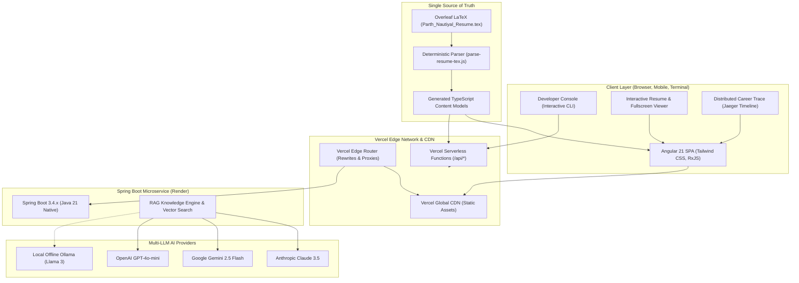
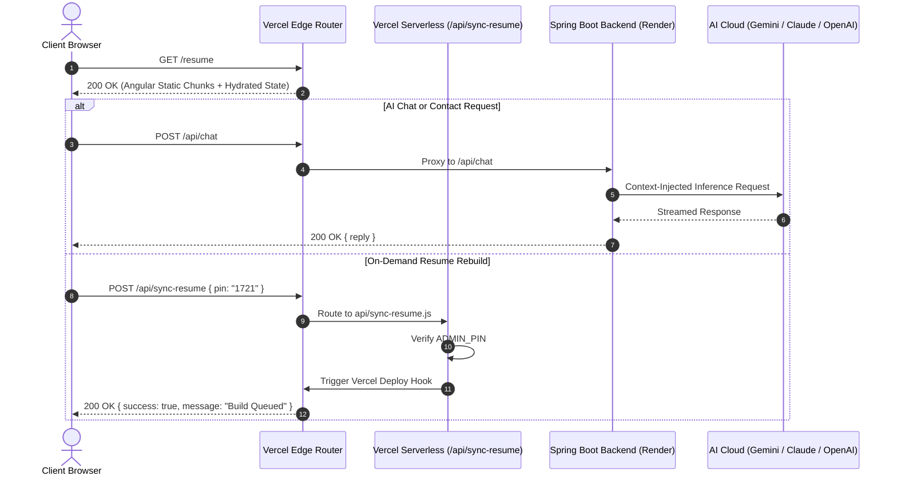

# Architecture: System Overview & Deployment Topography

This document outlines the high-level architecture, deployment infrastructure, network routing, and component boundaries of Parth Nautiyal's portfolio ecosystem.

---

## 1. High-Level System Architecture

<b>View Mermaid Source Code</b>

---

## 2. Request Routing & API Proxy Topography

---

## 3. Component & Module Topography

| Component Layer | Technologies Used | Core Responsibility |
| :--- | :--- | :--- |
| **Frontend UI** | Angular 21, Tailwind CSS v4, Lucide Icons, SimpleIcons | High-performance SPA with sub-second page transitions, reactive theme management, and full accessibility. |
| **Data Access Layer** | `contentLoader.ts`, `StorageAdapter` | Single responsibility data loader providing centralized typed access to resume models with automatic version eviction. |
| **Serverless Functions** | Node.js (Vercel Serverless) | Zero-overhead lightweight endpoints for GitHub profile scraping, resume deploy hook triggers, and AI job-matching scoring. |
| **Backend Core** | Spring Boot 3.4.x, Java 21, GraalVM Native Image | High-throughput microservice handling transactional email delivery, system health metrics, and multi-LLM orchestrations. |
| **Sync Pipeline** | `scripts/parse-resume-tex.js` | Zero-dependency deterministic parser transforming Overleaf LaTeX into strongly-typed TypeScript models during prebuild. |
