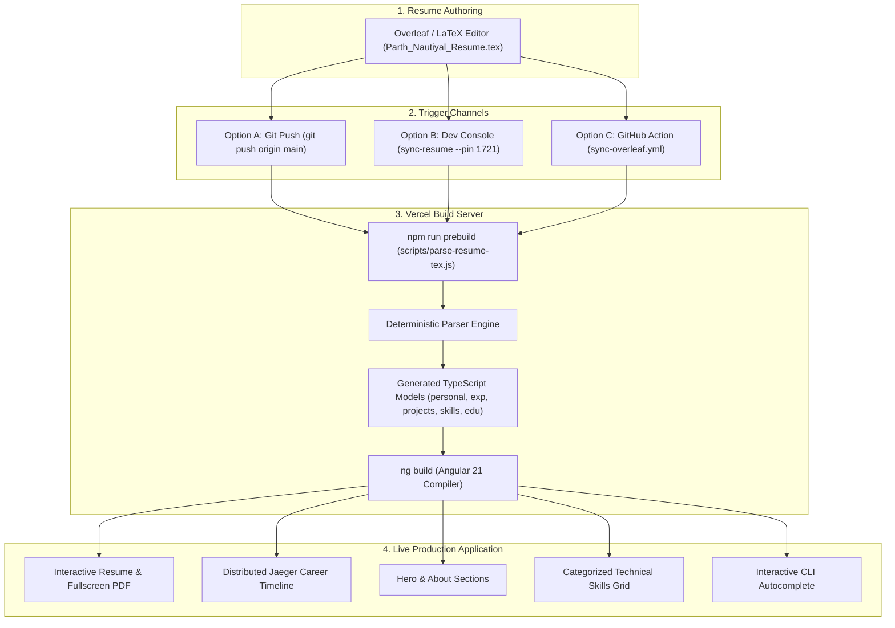
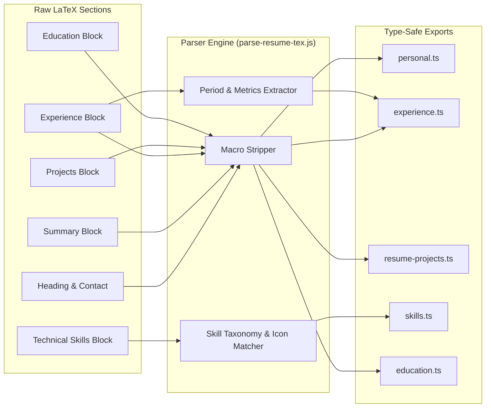
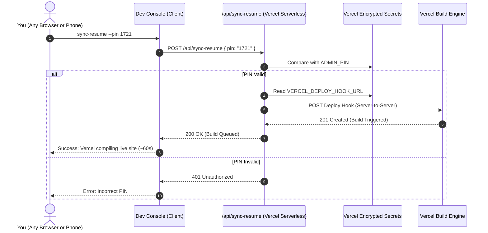

# Architecture: Overleaf / LaTeX Synchronization Pipeline

This document explains the end-to-end synchronization pipeline that establishes `Parth_Nautiyal_Resume.tex` as the single source of truth across the entire portfolio.

---

## 1. Complete Synchronization Workflow

<b>View Mermaid Source Code</b>

---

## 2. LaTeX Parser Token Extraction Engine

---

## 3. Cross-Device Zero-Config Security Architecture

