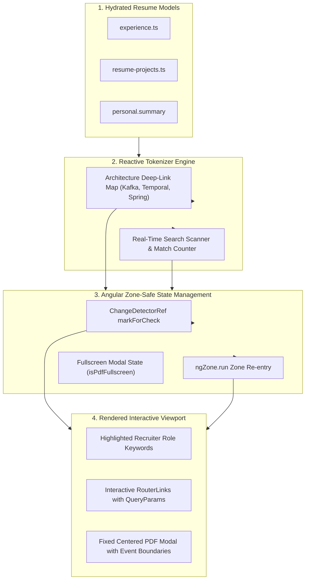
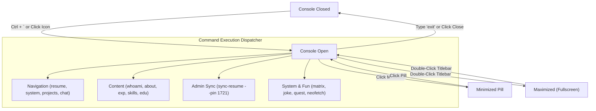
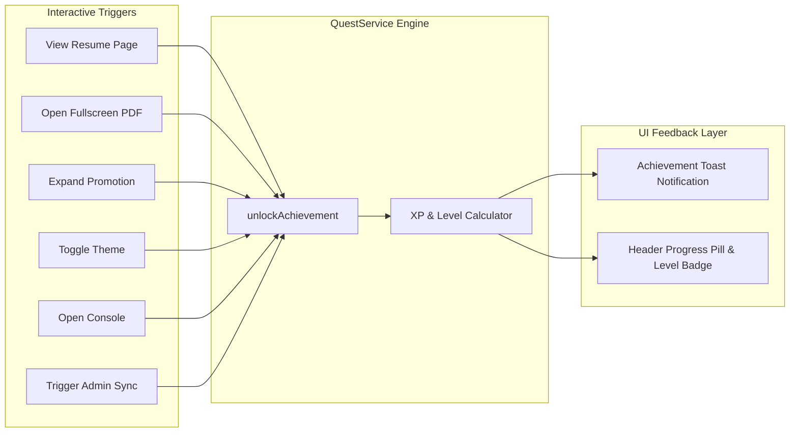

# Architecture: Interactive Features, State & Gamification

This document details the reactive state management, tokenized deep-linking, developer console CLI, and quest gamification subsystems.

---

## 1. Interactive Features & State Diagram

<b>View Mermaid Source Code</b>

---

## 2. Developer Console State Machine

---

## 3. Quest & Achievement Gamification Engine

