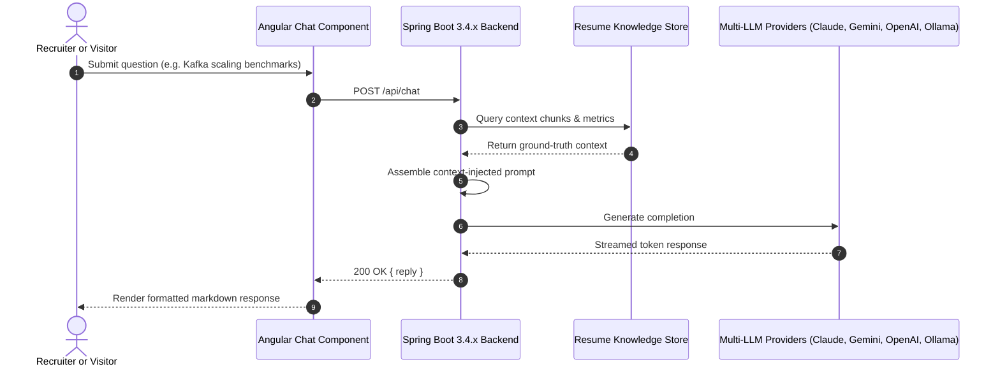
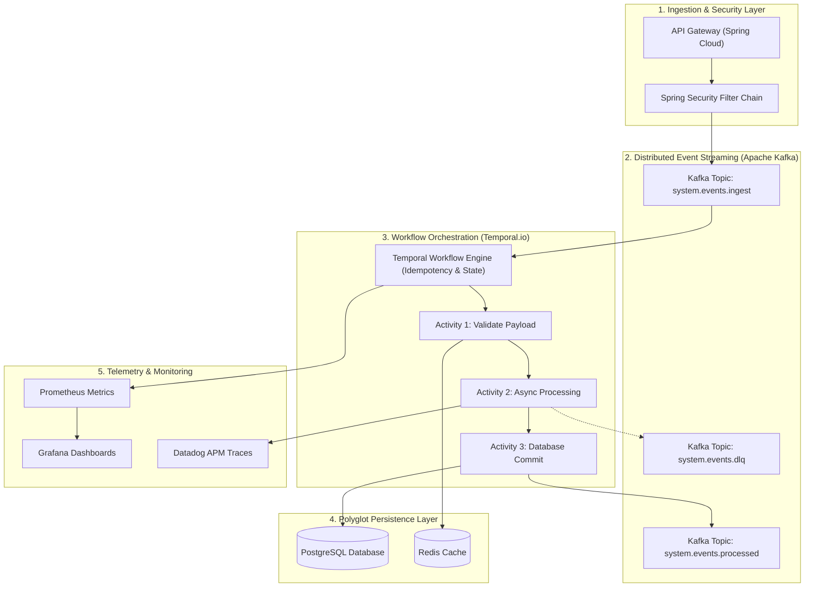

# Architecture: Multi-LLM RAG & Microservices Backend

This document details the backend microservices architecture, asynchronous event pipelines, and the multi-LLM retrieval-augmented generation (RAG) orchestration engine.

---

## 1. Multi-LLM RAG & Microservices Overview

<b>View Mermaid Source Code</b>

---

## 2. Distributed Microservices & Event Architecture

