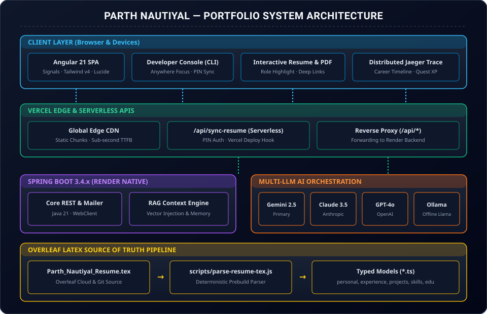
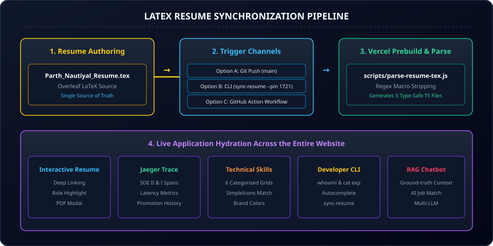
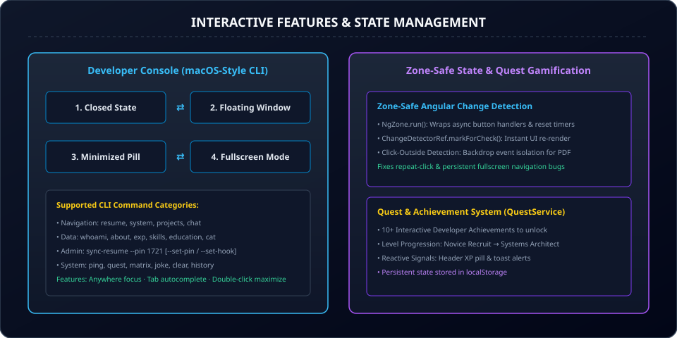
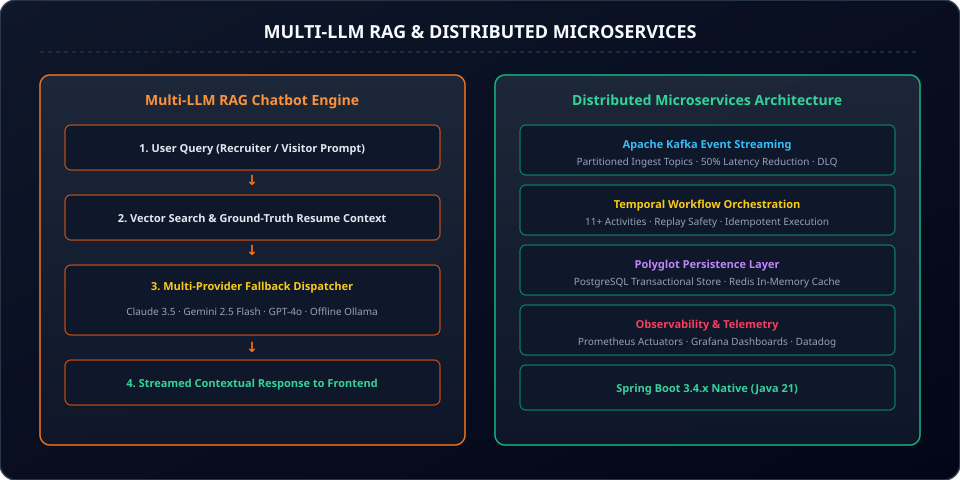

# Portfolio Architecture Documentation Index

Welcome to the comprehensive technical architecture and design documentation for **Parth Nautiyal's Full-Stack Systems Portfolio**.

---

## 📑 Documentation Index

| Document | Description | Visual Diagram |
| :--- | :--- | :--- |
| 🌐 **[01. System Overview & Deployment](01_SYSTEM_OVERVIEW.md)** | Full-stack deployment topography, network routing, edge proxies, and component boundaries. |  |
| 📄 **[02. Resume Synchronization Pipeline](02_RESUME_SYNC_PIPELINE.md)** | Single source of truth LaTeX pipeline, zero-config PIN deployment gatekeeper, and deterministic token parser. |  |
| 🎮 **[03. Interactive Features & State Management](03_INTERACTIVE_FEATURES_AND_STATE.md)** | Reactive state cycles, Angular Zone-safe change detection, macOS-style terminal CLI, and quest gamification. |  |
| 🤖 **[04. Multi-LLM RAG & Microservices](04_AI_AND_MICROSERVICES.md)** | Multi-provider AI fallback engine, prompt context injection, Kafka event streaming, and Temporal workflow orchestration. |  |
